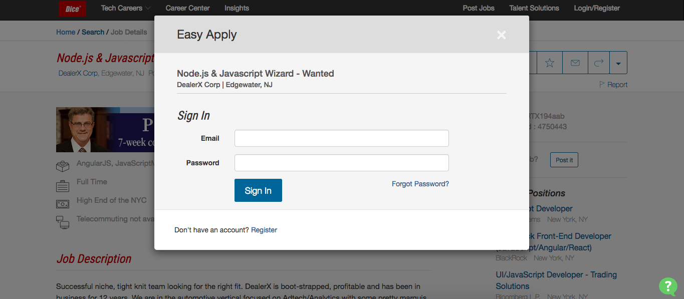

# auto-apply
A tool to help you apply to jobs more quickly and efficiently. You select your skill and location and then the bot will have
you login into Dice.com after that it will begin apply to all "Easy Apply" Jobs with your resume(beta)(This feature is glitchy). By default when you run the script it opens up 24 tabs of searched Jobs where you can just click apply and be done!



# start

By defualt it will find the first 10 pages of javascript jobs near NY that are one-click apply's and open 24 of them 
in your browser

``` bash
git clone https://github.com/Hitscotty/auto-apply && cd auto-apply
npm install
npm start
```

# requirements
I made this tool for myself so these are my defaults if you read my code you can 
find the proper places to make these changes. 

- Opera Web Browser
- Bash 
- npm 


